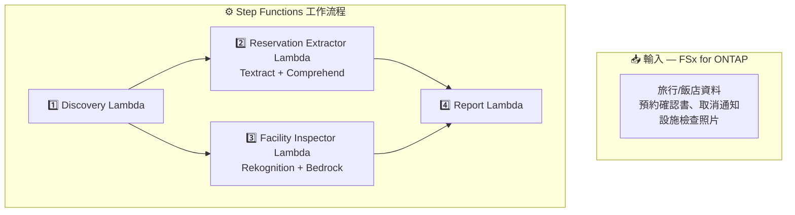

# UC20: 旅行與飯店業 — 預約文件處理 / 設施檢查影像分析 架構

🌐 **Language / 言語**: [日本語](architecture.md) | [English](architecture.en.md) | [한국어](architecture.ko.md) | [简体中文](architecture.zh-CN.md) | 繁體中文 | [Français](architecture.fr.md) | [Deutsch](architecture.de.md) | [Español](architecture.es.md)

## 架構圖

## 使用的 AWS 服務

| 服務 | 角色 |
|------|------|
| FSx for ONTAP | 預約文件和檢查影像儲存 |
| Amazon Textract | 文件分析（Cross-Region us-east-1） |
| Amazon Comprehend | 實體擷取和語言偵測 |
| Amazon Rekognition | 設施狀態影像分析 |
| Amazon Bedrock | 維護建議生成 |

## 關鍵設計決策

1. **平行處理** — 預約擷取和設施檢查獨立執行
2. **Cross-Region Textract** — 使用 us-east-1 取得完整功能
3. **多語言自動偵測** — Comprehend 偵測語言後選擇適當模型
4. **清潔度評分** — Rekognition 標籤由 Bedrock 轉換為 0–100 分數
5. **錯誤隔離** — 單一文件失敗不會中斷整個批次
