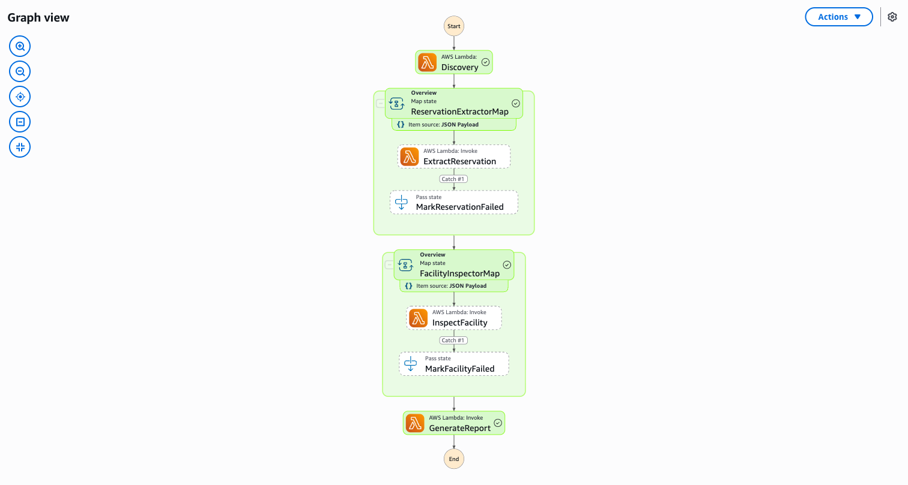

# 여행 및 호스피탈리티 — 예약 문서 처리 데모 가이드

🌐 **Language / 言語**: [日本語](demo-guide.md) | [English](demo-guide.en.md) | 한국어 | [简体中文](demo-guide.zh-CN.md) | [繁體中文](demo-guide.zh-TW.md) | [Français](demo-guide.fr.md) | [Deutsch](demo-guide.de.md) | [Español](demo-guide.es.md)

## 개요

호텔/여관의 예약 문서와 시설 점검 이미지의 자동 분석 파이프라인을 시연합니다. Textract/Comprehend를 통한 예약 데이터 추출과 Rekognition/Bedrock를 통한 시설 상태 분석을 자동화합니다.

**소요 시간**: 3~5분

---

## 단계별 배포 및 검증

### Step 1: 사전 요구사항 확인

```bash
aws --version && sam --version && python3 --version
aws sts get-caller-identity
```

### Step 2: 배포

```bash
git clone https://github.com/Yoshiki0705/fsxn-s3ap-serverless-patterns.git
cd fsxn-s3ap-serverless-patterns/solutions/industry/travel-document-processing
sam build && sam deploy \
  --stack-name fsxn-travel-demo \
  --parameter-overrides \
    S3AccessPointAlias=<your-s3ap-alias> \
    S3AccessPointName=<your-s3ap-name> \
    VpcId=<your-vpc-id> \
    PrivateSubnetIds=<subnet-1>,<subnet-2> \
    NotificationEmail=<your-email@example.com> \
  --capabilities CAPABILITY_IAM CAPABILITY_AUTO_EXPAND \
  --region ap-northeast-1
```

### Step 3: 워크플로우 실행 및 결과 확인

```bash
STATE_MACHINE_ARN=$(aws cloudformation describe-stacks \
  --stack-name fsxn-travel-demo \
  --query "Stacks[0].Outputs[?OutputKey=='WorkflowStateMachineArn'].OutputValue" \
  --output text --region ap-northeast-1)

aws stepfunctions start-execution --state-machine-arn $STATE_MACHINE_ARN --region ap-northeast-1
```

---

---

## 스크린샷




## 정리

```bash
aws cloudformation delete-stack --stack-name fsxn-travel-demo --region ap-northeast-1
```

---

## 관련 문서

> 배포나 실행에서 문제가 발생하면 공통 [배포 가이드](../../../../docs/en/deployment-guide.md#troubleshooting)를 참조하십시오.
> 일반적인 배포 오류와 함께 "실행은 성공했지만 결과가 비어 있는" 증상을 증상별로 정리해 두었습니다.
