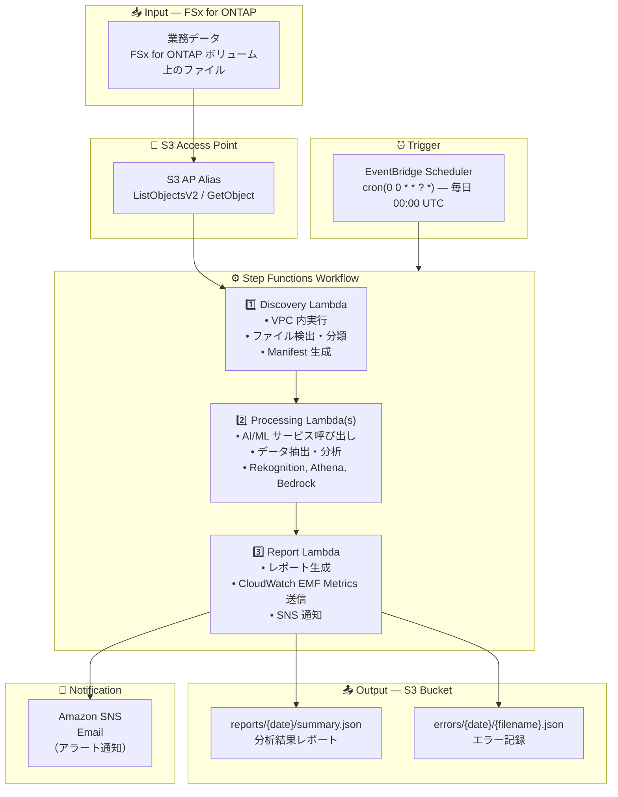

# UC25: 電力・ユーティリティ — ドローン画像点検 / SCADA 異常検知 アーキテクチャ

🌐 **Language / 言語**: 日本語 | [English](architecture.en.md) | [한국어](architecture.ko.md) | [简体中文](architecture.zh-CN.md) | [繁體中文](architecture.zh-TW.md) | [Français](architecture.fr.md) | [Deutsch](architecture.de.md) | [Español](architecture.es.md)

## End-to-End Architecture (Input → Output)

---

## Architecture Diagram

---

## Key Design Decisions

1. **エラー分離** — 1 ファイルの処理失敗が他のファイルの処理を阻害しない
2. **Exponential Backoff** — AI/ML サービスへのリトライは shared/retry_handler.py で統一管理
3. **ポーリングベース** — S3 AP はイベント通知非対応のため EventBridge Scheduler による日次実行
4. **Cross-Region 対応** — 全サービス ap-northeast-1 で利用可能
5. **Idempotency** — 同一ファイルの再処理で重複レコードが生成されない設計

---

## AWS Services Used

| サービス | 役割 |
|---------|------|
| FSx for ONTAP | ファイルストレージ |
| S3 Access Points | ONTAP ボリュームへのサーバーレスアクセス |
| EventBridge Scheduler | 日次トリガー |
| Step Functions | ワークフローオーケストレーション |
| Lambda | コンピュート（Discovery, Defect Detector, SCADA Analyzer, Thermal Analyzer, Report） |
| Amazon Rekognition | AI/ML 処理 |
| Amazon Athena | AI/ML 処理 |
| Amazon Bedrock | AI/ML 処理 |
| SNS | アラート通知 |
| Secrets Manager | ONTAP REST API 認証情報管理 |
| CloudWatch + X-Ray | オブザーバビリティ |
