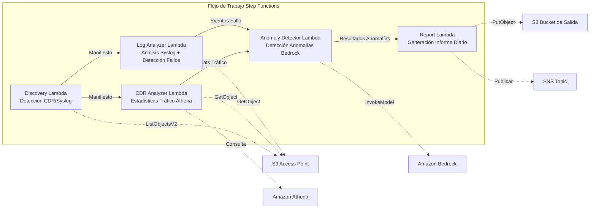

# UC18: Telecomunicaciones / Análisis de Red — Detección de Anomalías CDR/Logs de Red e Informes de Cumplimiento

🌐 **Language / 言語**: [日本語](README.md) | [English](README.en.md) | [한국어](README.ko.md) | [简体中文](README.zh-CN.md) | [繁體中文](README.zh-TW.md) | [Français](README.fr.md) | [Deutsch](README.de.md) | Español

📚 **Documentación**: [Diagrama de Arquitectura](docs/architecture.es.md) | [Guía de Demo](docs/demo-guide.es.md)

## Descripción General

Flujo de trabajo serverless que aprovecha los S3 Access Points de Amazon FSx for ONTAP para automatizar el análisis de CDR (Registros Detallados de Llamadas) y logs de equipos de red, detección de anomalías, estadísticas de tráfico y generación de informes de cumplimiento.

### Casos de Uso Adecuados

- Los archivos CDR (CSV, ASN.1 decodificado, Parquet) están almacenados en FSx ONTAP
- Se necesita análisis automático de datos syslog / SNMP trap de equipos de red
- Se requieren estadísticas de tráfico via Athena (volumen de llamadas por hora, duración media, llamadas simultáneas pico)
- Se requiere detección de anomalías via Bedrock (comparación con línea base móvil de 7 días, umbral 3σ)
- Se necesita detección y alerta automática de fallos de equipo (link-down, errores de hardware, caídas de proceso)

### Funcionalidades Principales

- Detección automática de archivos CDR (.csv, .asn1, .parquet) y archivos syslog via S3 AP
- Análisis estadístico de tráfico via Athena (volumen de llamadas, duración, conexiones simultáneas pico)
- Detección de anomalías via Bedrock (umbral 3σ, comparación con línea base de 7 días)
- Análisis Syslog RFC 5424 + datos SNMP trap
- Detección de fallos de equipo (link-down, errores de hardware, exceso de umbral de capacidad)
- Informe diario de salud de red + alertas de anomalías (SNS)

## Indicadores de Éxito (Success Metrics)

### Resultado Esperado (Outcome)
Automatizar el análisis de CDR/logs de red para acelerar la detección de fallos de red y planificación de capacidad para operadores de telecomunicaciones.

### Indicadores (Metrics)
| Indicador | Valor Objetivo (Ejemplo) |
|-----------|------------------------|
| Archivos CDR procesados / ejecución | > 200 archivos |
| Precisión de detección de anomalías | > 90% |
| Tasa de detección de fallos de equipo | > 95% |
| Tiempo de generación de informes | < 5 min / lote diario |
| Costo / ejecución diaria | < $1.00 |
| Tasa de revisión humana necesaria | > 20% (anomalías críticas verificadas completamente) |

### Método de Medición
Historial de ejecución de Step Functions, resultados de consultas Athena, logs de inferencia Bedrock, CloudWatch EMF Metrics (ProcessingDuration, SuccessCount, ErrorCount).

### Requisitos de Revisión Humana
- Las anomalías críticas que excedan 3σ son alertadas automáticamente y confirmadas por humanos
- Los fallos de equipo (link-down) activan notificación inmediata + confirmación del operador
- Los informes de tendencias mensuales son revisados por el equipo de planificación de red

## Arquitectura



> **Nota S3 AP NetworkOrigin**: La Lambda Discovery se despliega dentro de un VPC. Si el NetworkOrigin del S3 Access Point es `Internet`, no se puede acceder a través del S3 Gateway VPC Endpoint (las solicitudes no se enrutan al plano de datos FSx). Use un S3 AP de tipo VPC-origin o configure el acceso mediante NAT Gateway. Ver [Notas de compatibilidad S3AP](../docs/s3ap-compatibility-notes.md).

## Despliegue

```bash
aws cloudformation deploy \
  --template-file telecom-network-analytics/template.yaml \
  --stack-name fsxn-telecom-analytics \
  --parameter-overrides \
    S3AccessPointAlias=<your-volume-ext-s3alias> \
    S3AccessPointName=<your-s3ap-name> \
    VpcId=<your-vpc-id> \
    PrivateSubnetIds=<subnet-1>,<subnet-2> \
    ScheduleExpression="cron(0 0 * * ? *)" \
    NotificationEmail=<your-email@example.com> \
    CdrSuffixFilter=".csv,.asn1,.parquet" \
    AnomalyThresholdStdDev=3 \
    CapacityThresholdPercent=80 \
  --capabilities CAPABILITY_IAM CAPABILITY_AUTO_EXPAND \
  --region ap-northeast-1
```


## ⚠️ Consideraciones de rendimiento

- La capacidad de rendimiento de FSx for ONTAP se **comparte entre NFS/SMB/S3 AP**. Ejecutar con MapConcurrency=10 en paralelo puede afectar otras cargas de trabajo en el mismo volumen.
- Para el procesamiento por lotes de gran volumen, verifique la Throughput Capacity (MBps) de FSx ONTAP y ajuste MapConcurrency en consecuencia.
- Recomendado: Comience con MapConcurrency=5 en producción, monitoree las métricas de CloudWatch (ThroughputUtilization) y aumente gradualmente.

## Limpieza (Cleanup)

```bash
aws s3 rm s3://fsxn-telecom-analytics-output-${AWS_ACCOUNT_ID} --recursive

aws cloudformation delete-stack \
  --stack-name fsxn-telecom-analytics \
  --region ap-northeast-1
```

## Nota de Gobernanza

> Este patrón proporciona orientación de arquitectura técnica. No constituye asesoramiento legal, de cumplimiento o regulatorio. Los datos CDR contienen datos de comunicación personal y deben ser tratados de acuerdo con las regulaciones de telecomunicaciones y leyes de privacidad aplicables.

> **Related Regulations**: 電気通信事業法 (Telecommunications Business Act), 個人情報保護法 (APPI - Personal Information Protection)
