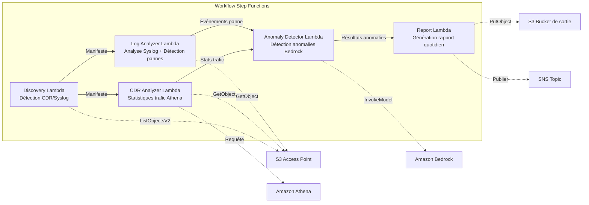

# UC18 : Télécommunications / Analyse Réseau — Détection d'anomalies CDR/journaux réseau et rapports de conformité

🌐 **Language / 言語**: [日本語](README.md) | [English](README.en.md) | [한국어](README.ko.md) | [简体中文](README.zh-CN.md) | [繁體中文](README.zh-TW.md) | Français | [Deutsch](README.de.md) | [Español](README.es.md)

📚 **Documentation** : [Diagramme d'architecture](docs/architecture.fr.md) | [Guide de démo](docs/demo-guide.fr.md)

## Aperçu

Workflow serverless exploitant les S3 Access Points d'Amazon FSx for ONTAP pour automatiser l'analyse des CDR (enregistrements détaillés d'appels) et des journaux d'équipements réseau, la détection d'anomalies, les statistiques de trafic et la génération de rapports de conformité.

### Cas d'utilisation adaptés

- Les fichiers CDR (CSV, ASN.1 décodé, Parquet) sont stockés sur FSx ONTAP
- Analyse automatique des données syslog / SNMP trap des équipements réseau
- Statistiques de trafic via Athena (volume d'appels par heure, durée moyenne, appels simultanés au pic)
- Détection d'anomalies via Bedrock (comparaison avec baseline glissante de 7 jours, seuil 3σ)
- Détection et alerte automatiques des pannes d'équipement (link-down, erreurs matérielles, crash de processus)

### Fonctionnalités principales

- Détection automatique des fichiers CDR (.csv, .asn1, .parquet) et syslog via S3 AP
- Analyse statistique du trafic via Athena (volume d'appels, durée, connexions simultanées au pic)
- Détection d'anomalies via Bedrock (seuil 3σ, comparaison baseline 7 jours)
- Analyse Syslog RFC 5424 + données SNMP trap
- Détection de pannes d'équipement (link-down, erreurs matérielles, dépassement de capacité)
- Rapport quotidien de santé réseau + alertes d'anomalies (SNS)

## Indicateurs de succès (Success Metrics)

### Résultat attendu (Outcome)
Automatiser l'analyse CDR/journaux réseau pour accélérer la détection de pannes et la planification de capacité des opérateurs télécoms.

### Indicateurs (Metrics)
| Indicateur | Valeur cible (exemple) |
|-----------|----------------------|
| Fichiers CDR traités / exécution | > 200 fichiers |
| Précision de détection d'anomalies | > 90% |
| Taux de détection de pannes | > 95% |
| Temps de génération de rapport | < 5 min / lot quotidien |
| Coût / exécution quotidienne | < $1.00 |
| Taux de revue humaine nécessaire | > 20% (anomalies critiques entièrement vérifiées) |

### Méthode de mesure
Historique d'exécution Step Functions, résultats Athena, journaux d'inférence Bedrock, CloudWatch EMF Metrics (ProcessingDuration, SuccessCount, ErrorCount).

### Exigences de revue humaine
- Les anomalies critiques dépassant 3σ sont automatiquement alertées puis confirmées par un humain
- Les pannes d'équipement (link-down) déclenchent une notification immédiate + confirmation opérateur
- Les rapports de tendance mensuels sont revus par l'équipe de planification réseau

## Architecture



> **Note S3 AP NetworkOrigin** : La Lambda Discovery est déployée dans un VPC. Si le NetworkOrigin du S3 Access Point est `Internet`, l'accès via S3 Gateway VPC Endpoint n'est pas possible (les requêtes ne sont pas routées vers le plan de données FSx). Utilisez un S3 AP VPC-origin ou configurez l'accès via NAT Gateway. Voir [Notes de compatibilité S3AP](../docs/s3ap-compatibility-notes.md).

## Déploiement

```bash
aws cloudformation deploy \
  --template-file telecom-network-analytics/template.yaml \
  --stack-name fsxn-telecom-analytics \
  --parameter-overrides \
    S3AccessPointAlias=<your-volume-ext-s3alias> \
    S3AccessPointName=<your-s3ap-name> \
    VpcId=<your-vpc-id> \
    PrivateSubnetIds=<subnet-1>,<subnet-2> \
    ScheduleExpression="cron(0 0 * * ? *)" \
    NotificationEmail=<your-email@example.com> \
    CdrSuffixFilter=".csv,.asn1,.parquet" \
    AnomalyThresholdStdDev=3 \
    CapacityThresholdPercent=80 \
  --capabilities CAPABILITY_IAM CAPABILITY_AUTO_EXPAND \
  --region ap-northeast-1
```


## ⚠️ Considérations de performance

- La capacité de débit de FSx for ONTAP est **partagée entre NFS/SMB/S3 AP**. L'exécution avec MapConcurrency=10 en parallèle peut impacter d'autres charges de travail sur le même volume.
- Pour le traitement par lots volumineux, vérifiez la Throughput Capacity (MBps) de FSx ONTAP et ajustez MapConcurrency en conséquence.
- Recommandé : Commencez avec MapConcurrency=5 en production, surveillez les métriques CloudWatch (ThroughputUtilization) et augmentez progressivement.

## Nettoyage (Cleanup)

```bash
aws s3 rm s3://fsxn-telecom-analytics-output-${AWS_ACCOUNT_ID} --recursive

aws cloudformation delete-stack \
  --stack-name fsxn-telecom-analytics \
  --region ap-northeast-1
```

## Note de gouvernance

> Ce modèle fournit des conseils d'architecture technique. Il ne constitue pas un avis juridique, de conformité ou réglementaire. Les données CDR contiennent des données de communication personnelles et doivent être traitées conformément aux réglementations télécoms et aux lois sur la protection des données applicables.

> **Related Regulations**: 電気通信事業法 (Telecommunications Business Act), 個人情報保護法 (APPI - Personal Information Protection)
