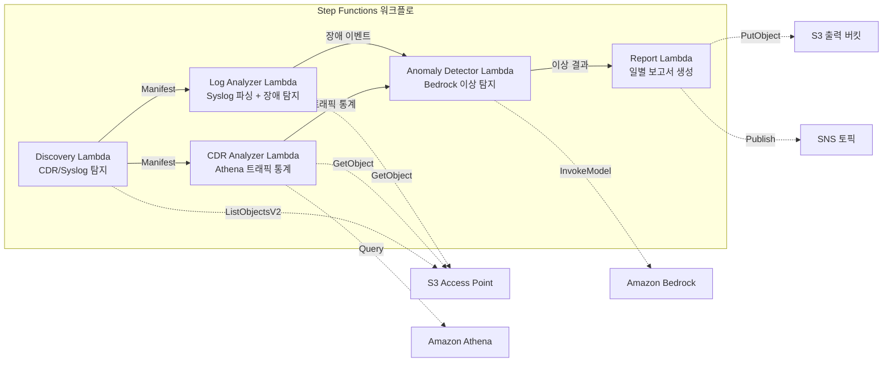

# UC18: 통신 / 네트워크 분석 — CDR/네트워크 로그 이상 탐지 및 컴플라이언스 보고서

🌐 **Language / 言語**: [日本語](README.md) | [English](README.en.md) | 한국어 | [简体中文](README.zh-CN.md) | [繁體中文](README.zh-TW.md) | [Français](README.fr.md) | [Deutsch](README.de.md) | [Español](README.es.md)

📚 **문서**: [아키텍처 다이어그램](docs/architecture.ko.md) | [데모 가이드](docs/demo-guide.ko.md)

## 개요

Amazon FSx for ONTAP의 S3 Access Points를 활용하여 CDR(통화 상세 기록)과 네트워크 장비 로그의 이상 탐지, 트래픽 통계 분석, 컴플라이언스 보고서 자동 생성을 실현하는 서버리스 워크플로입니다.

### 이 패턴이 적합한 경우

- CDR 파일(CSV, ASN.1 디코딩, Parquet)이 FSx ONTAP에 축적되어 있는 경우
- 네트워크 장비의 syslog / SNMP 트랩 데이터를 자동으로 분석하고 싶은 경우
- Athena를 통한 트래픽 통계(시간대별 통화량, 평균 통화 시간, 최대 동시 통화 수)가 필요한 경우
- Bedrock을 통한 이상 탐지(7일 롤링 기준선 비교, 3σ 초과 탐지)를 원하는 경우
- 장비 장애(link-down, 하드웨어 오류, 프로세스 크래시) 자동 탐지 및 알림이 필요한 경우

### 주요 기능

- S3 AP를 통해 CDR 파일(.csv, .asn1, .parquet)과 syslog 파일을 자동 탐지
- Athena를 통한 트래픽 통계 분석(통화량, 통화 시간, 최대 동시 연결 수)
- Bedrock을 통한 이상 탐지(3σ 임계값, 7일 기준선 비교)
- Syslog RFC 5424 파싱 + SNMP 트랩 데이터 분석
- 장비 장애 탐지(link-down, 하드웨어 오류, 용량 임계값 초과)
- 일별 네트워크 상태 보고서 + 이상 알림(SNS)

## 성공 지표 (Success Metrics)

### 기대 성과 (Outcome)
CDR/네트워크 로그 분석 자동화를 통해 통신 사업자의 네트워크 장애 탐지 및 용량 계획을 가속화한다.

### 지표 (Metrics)
| 지표 | 목표값 (예시) |
|------|-------------|
| 실행당 처리된 CDR 파일 수 | > 200 파일 |
| 이상 탐지 정확도 | > 90% |
| 장비 장애 탐지율 | > 95% |
| 보고서 생성 시간 | < 5분 / 일별 배치 |
| 비용 / 일별 실행 | < $1.00 |
| 인간 검토 필요 비율 | > 20% (중대 이상은 전수 확인) |

### 측정 방법 (Measurement Method)
Step Functions 실행 이력, Athena 쿼리 결과, Bedrock 추론 로그, CloudWatch EMF 메트릭(ProcessingDuration, SuccessCount, ErrorCount).

### 인간 검토 요건 (Human Review Requirements)
- 3σ 초과 중대 이상은 자동 알림 후 인간 확인
- 장비 장애(link-down)는 즉시 통보 + 운영자 확인
- 월별 트렌드 보고서는 네트워크 계획 팀이 검토

## 아키텍처



> **S3 AP NetworkOrigin 참고**: Discovery Lambda는 VPC 내에 배포됩니다. S3 Access Point의 NetworkOrigin이 `Internet`인 경우 S3 Gateway VPC Endpoint를 통해 액세스할 수 없습니다 (FSx 데이터 플레인으로 라우팅되지 않음). VPC-origin S3 AP를 사용하거나 NAT Gateway 액세스를 구성하세요. [S3AP 호환성 참고](../docs/s3ap-compatibility-notes.md)를 참조하세요.

## 배포 방법

```bash
aws cloudformation deploy \
  --template-file telecom-network-analytics/template.yaml \
  --stack-name fsxn-telecom-analytics \
  --parameter-overrides \
    S3AccessPointAlias=<your-volume-ext-s3alias> \
    S3AccessPointName=<your-s3ap-name> \
    VpcId=<your-vpc-id> \
    PrivateSubnetIds=<subnet-1>,<subnet-2> \
    ScheduleExpression="cron(0 0 * * ? *)" \
    NotificationEmail=<your-email@example.com> \
    CdrSuffixFilter=".csv,.asn1,.parquet" \
    AnomalyThresholdStdDev=3 \
    CapacityThresholdPercent=80 \
  --capabilities CAPABILITY_IAM CAPABILITY_AUTO_EXPAND \
  --region ap-northeast-1
```


## ⚠️ 성능 고려사항

- FSx for ONTAP의 처리량 용량은 **NFS/SMB/S3 AP에서 공유**됩니다. MapConcurrency=10으로 병렬 처리 시 동일 볼륨의 다른 워크로드에 영향을 줄 수 있습니다.
- 대량 파일 일괄 처리 시 FSx ONTAP의 Throughput Capacity (MBps)를 확인하고 MapConcurrency를 조정하세요.
- 권장: 프로덕션 환경에서는 MapConcurrency=5로 시작하고 CloudWatch 메트릭 (ThroughputUtilization)을 모니터링하면서 점진적으로 증가시키세요.

## 정리 (Cleanup)

```bash
aws s3 rm s3://fsxn-telecom-analytics-output-${AWS_ACCOUNT_ID} --recursive

aws cloudformation delete-stack \
  --stack-name fsxn-telecom-analytics \
  --region ap-northeast-1
```

## Governance Note

> 이 패턴은 기술 아키텍처 가이드를 제공합니다. 법적, 컴플라이언스 또는 규제 조언이 아닙니다. CDR 데이터는 개인 통신 데이터를 포함하므로 관련 법규를 준수하여 처리해야 합니다.

> **Related Regulations**: 電気通信事業法 (Telecommunications Business Act), 個人情報保護法 (APPI - Personal Information Protection)
