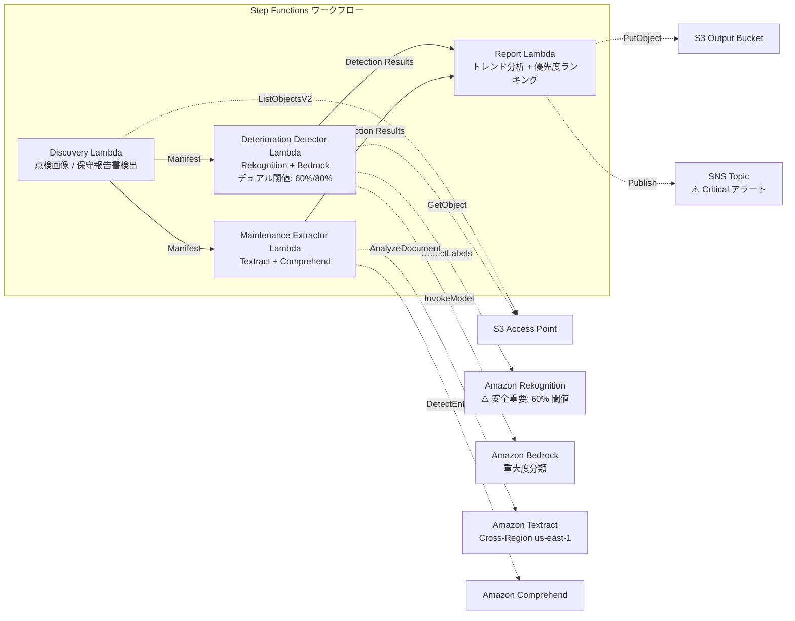

# UC22: 運輸・鉄道 — 設備点検画像分析 / 保守レポート管理

🌐 **Language / 言語**: 日本語 | [English](README.en.md) | [한국어](README.ko.md) | [简体中文](README.zh-CN.md) | [繁體中文](README.zh-TW.md) | [Français](README.fr.md) | [Deutsch](README.de.md) | [Español](README.es.md)

📚 **ドキュメント**: [アーキテクチャ図](docs/architecture.md) | [デモガイド](docs/demo-guide.md)

## 概要

FSx for ONTAP の S3 Access Points を活用し、鉄道インフラの点検画像から劣化指標（亀裂、錆、変位）を検出し、重大度分類と保守優先度ランキングを自動生成するサーバーレスワークフローです。**安全重要インフラ（橋梁、信号設備、レール接合部）に対しては、より低い検出閾値を適用し、人間レビューを必須化する安全設計**を採用しています。

### このパターンが適しているケース

- 鉄道設備の定期点検画像（軌道、橋梁、信号設備）が FSx ONTAP に蓄積されている
- 劣化パターン（亀裂、錆、変位）をAIで自動検出し重大度を分類したい
- 保守報告書（PDF、Excel）から修理履歴とライフサイクルデータを自動抽出したい
- 安全重要インフラに対して低閾値検出 + 人間レビューフラグが必要
- 12ヶ月間の劣化トレンド分析と保守優先度ランキングが必要

### このパターンが適さないケース

- リアルタイムの列車運行管理が必要
- 完全な CMMS（設備保全管理システム）の構築が必要
- ONTAP REST API へのネットワーク到達性が確保できない環境

### 主な機能

- S3 AP 経由で点検画像（JPEG/PNG/TIFF）と保守報告書（PDF/Excel）を自動検出
- Rekognition による劣化指標検出（デュアル閾値: 標準 80%、安全重要 60%）
- Bedrock による重大度分類（critical / major / minor / observation）
- 安全重要インフラ: 90% 未満の検出はすべて `human_review_required: true`
- Textract + Comprehend による保守報告書の修理履歴・ライフサイクルデータ抽出
- 12ヶ月劣化トレンド分析 + 重大度×部品年齢による保守優先度ランキング
- 低解像度画像（< 1024×768）は `requires-reinspection` 自動マーク

## Success Metrics

### Outcome
設備点検画像の AI 分析により、鉄道インフラの劣化早期発見と保守計画の最適化を実現する。安全重要インフラの見逃しリスクを最小化する。

### Metrics
| メトリクス | 目標値（例） |
|-----------|------------|
| 劣化検出率（標準インフラ） | ≥ 85% (80% confidence) |
| 劣化検出率（安全重要インフラ） | ≥ 95% (60% confidence) |
| 重大度分類精度 | ≥ 80% |
| 偽陰性率（安全重要） | < 5% |
| レポート生成時間 | < 5 分 / バッチ |
| Human Review 必須率 | > 30%（安全重要は全 < 90% 検出） |

### Measurement Method
Step Functions 実行履歴、Rekognition 検出ログ、Bedrock 分類結果、CloudWatch EMF Metrics（ProcessingDuration, SuccessCount, ErrorCount, HumanReviewCount）。

### Human Review Requirements
- **安全重要インフラ（橋梁、信号、レール接合部）**: 90% 未満の全検出に人間レビュー必須
- **critical 重大度**: 即時通知 + 48 時間以内のエンジニア確認
- **低解像度画像**: 再点検スケジュールの設定
- 月次劣化トレンドレポートは保守計画チームがレビュー

## アーキテクチャ



## 安全設計（Safety-Critical Design）

| カテゴリ | 閾値 | Human Review |
|---------|------|-------------|
| 標準インフラ（一般軌道） | Rekognition ≥ 80% | 検出結果のみ記録 |
| 安全重要インフラ（橋梁） | Rekognition ≥ 60% | < 90% は全件レビュー |
| 安全重要インフラ（信号設備） | Rekognition ≥ 60% | < 90% は全件レビュー |
| 安全重要インフラ（レール接合部） | Rekognition ≥ 60% | < 90% は全件レビュー |
| 低解像度画像 (< 1024×768) | — | `requires-reinspection` マーク |

## 前提条件

> **S3 AP NetworkOrigin 注意**: Discovery Lambda は VPC 内に配置されます。S3 Access Point の NetworkOrigin が `Internet` の場合、S3 Gateway VPC Endpoint 経由ではアクセスできません（FSx データプレーンにルーティングされないため）。NetworkOrigin=VPC の S3 AP を使用するか、NAT Gateway 経由のアクセスを設定してください。詳細は [S3AP Compatibility Notes](../docs/s3ap-compatibility-notes.md) を参照。

- AWS アカウントと適切な IAM 権限
- FSx for ONTAP ファイルシステム（ONTAP 9.17.1P4D3 以上）
- S3 Access Point が有効化されたボリューム
- VPC、プライベートサブネット
- Amazon Bedrock モデルアクセスが有効
- Amazon Textract — Cross-Region (us-east-1) 呼び出し設定

## デプロイ手順

```bash
aws cloudformation deploy \
  --template-file transportation-maintenance/template.yaml \
  --stack-name fsxn-transport-maintenance \
  --parameter-overrides \
    S3AccessPointAlias=<your-volume-ext-s3alias> \
    S3AccessPointName=<your-s3ap-name> \
    VpcId=<your-vpc-id> \
    PrivateSubnetIds=<subnet-1>,<subnet-2> \
    ScheduleExpression="cron(0 0 * * ? *)" \
    NotificationEmail=<your-email@example.com> \
  --capabilities CAPABILITY_IAM CAPABILITY_AUTO_EXPAND \
  --region ap-northeast-1
```

## コスト見積もり（月額概算）

| 構成 | 月額概算 |
|------|---------|
| 最小構成（日次 1 回） | ~$10-25 |
| 標準構成 | ~$25-70 |

---

## ⚠️ パフォーマンスに関する注意事項

- FSx for ONTAP のスループットキャパシティは **NFS/SMB/S3 AP 全体で共有**されます。MapConcurrency=10 で並列処理を行う場合、同一ボリュームの他のワークロードに影響する可能性があります。
- 大量ファイルの一括処理を行う場合は、FSx ONTAP の Throughput Capacity (MBps) を確認し、必要に応じて MapConcurrency を調整してください。
- 推奨: 本番環境では最初に MapConcurrency=5 で開始し、FSx ONTAP の CloudWatch メトリクス (ThroughputUtilization) を監視しながら段階的に増加させてください。

## Governance Note

> 本パターンは技術アーキテクチャガイダンスを提供します。法的・コンプライアンス・規制上の助言ではありません。鉄道インフラの安全管理は鉄道事業法および各種技術基準に準拠する必要があります。AI による検出結果は最終判断ではなく、有資格エンジニアによる確認が必須です。

> **関連規制**: 鉄道事業法、運輸安全委員会設置法

---

## S3AP Compatibility

[S3AP Compatibility Notes](../docs/s3ap-compatibility-notes.md) を参照してください。
