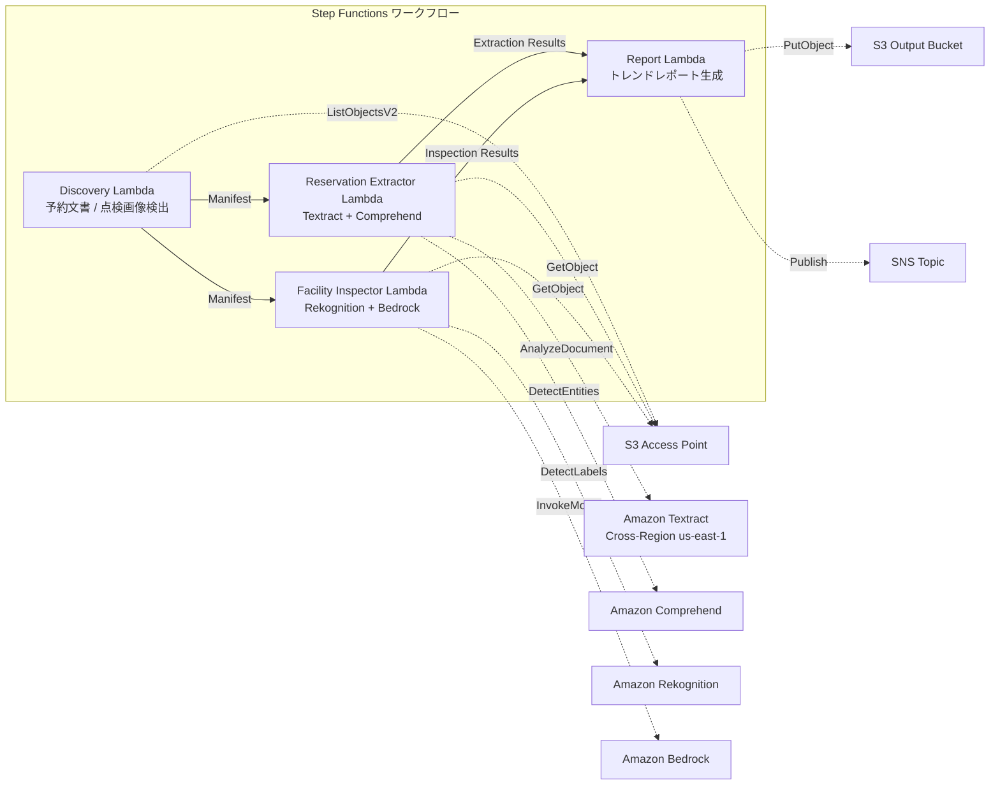

# UC20: 旅行・ホスピタリティ — 予約文書処理 / 施設点検画像分析

🌐 **Language / 言語**: 日本語 | [English](README.en.md) | [한국어](README.ko.md) | [简体中文](README.zh-CN.md) | [繁體中文](README.zh-TW.md) | [Français](README.fr.md) | [Deutsch](README.de.md) | [Español](README.es.md)

📚 **ドキュメント**: [アーキテクチャ図](docs/architecture.md) | [デモガイド](docs/demo-guide.md)

## 概要

FSx for ONTAP の S3 Access Points を活用し、ホテル・旅館の予約文書（PDF、スキャン画像）から構造化データを自動抽出し、施設点検画像の状態分析・メンテナンス推奨を自動生成するサーバーレスワークフローです。

### このパターンが適しているケース

- 予約確認書、キャンセル通知、ゲスト対応文書が FSx ONTAP 上に蓄積されている
- 予約文書から宿泊者名、日付、部屋タイプ、金額を自動抽出したい
- 施設点検画像（客室、共用部、外装）の状態をAIで自動評価したい
- 多言語対応（日本語以外のゲスト文書）の自動処理が必要
- 施設状態のトレンド分析と予防保全計画に活用したい

### このパターンが適さないケース

- リアルタイムの予約管理システム（PMS）が必要
- チェックイン/チェックアウトの即時処理が必要
- 完全な施設管理（CAFM）プラットフォームが必要
- ONTAP REST API へのネットワーク到達性が確保できない環境

### 主な機能

- S3 AP 経由で予約文書（PDF、スキャン画像）と施設点検画像を自動検出
- Textract + Comprehend による予約データ構造化抽出（宿泊者名、日付、部屋タイプ、金額）
- 多言語対応（言語検出 → Textract ヒント + Comprehend モデル自動選択）
- Rekognition による施設状態分析（損傷検出、清潔度スコアリング 0–100）
- Bedrock によるメンテナンス推奨生成
- 施設状態トレンドレポート + 予約処理サマリ（JSON + 人間可読形式）

## Success Metrics

### Outcome
予約文書処理と施設点検画像分析の自動化により、ホテルチェーンのオペレーション効率化と施設品質維持を実現する。

### Metrics
| メトリクス | 目標値（例） |
|-----------|------------|
| 予約データ抽出精度 | ≥ 90% |
| 施設状態検出率 | ≥ 85% |
| 多言語対応カバレッジ | ≥ 5 言語 |
| レポート生成時間 | < 5 分 / バッチ |
| コスト / 日次実行 | < $2.00 |
| Human Review 必須率 | > 15%（損傷検出時は全件確認） |

### Measurement Method
Step Functions 実行履歴、Textract/Comprehend 抽出結果、Rekognition 分析ログ、CloudWatch EMF Metrics（ProcessingDuration, SuccessCount, ErrorCount）。

### Human Review Requirements
- 施設損傷検出時は施設管理チームが確認・対応判断
- 抽出精度が低い文書は手動確認
- 月次施設状態トレンドレポートは経営層がレビュー

## アーキテクチャ



### ワークフローステップ

1. **Discovery**: S3 AP から予約文書と施設点検画像を検出
2. **Reservation Extractor**: Textract で文書解析 + Comprehend でエンティティ抽出（多言語対応）
3. **Facility Inspector**: Rekognition で施設状態分析 + Bedrock でメンテナンス推奨生成
4. **Report**: 施設状態トレンドレポート + 予約処理サマリ生成、SNS 通知

## 前提条件

> **S3 AP NetworkOrigin 注意**: Discovery Lambda は VPC 内に配置されます。S3 Access Point の NetworkOrigin が `Internet` の場合、S3 Gateway VPC Endpoint 経由ではアクセスできません（FSx データプレーンにルーティングされないため）。NetworkOrigin=VPC の S3 AP を使用するか、NAT Gateway 経由のアクセスを設定してください。詳細は [S3AP Compatibility Notes](../docs/s3ap-compatibility-notes.md) を参照。

- AWS アカウントと適切な IAM 権限
- FSx for ONTAP ファイルシステム（ONTAP 9.17.1P4D3 以上）
- S3 Access Point が有効化されたボリューム
- VPC、プライベートサブネット
- Amazon Bedrock モデルアクセスが有効（Claude / Nova）
- Amazon Textract — Cross-Region (us-east-1) 呼び出し設定

## デプロイ手順

### 1. パラメータの確認

予約文書のパスパターンと施設点検画像ディレクトリを事前に確認します。

### 2. CloudFormation デプロイ

```bash
aws cloudformation deploy \
  --template-file travel-document-processing/template.yaml \
  --stack-name fsxn-travel-processing \
  --parameter-overrides \
    S3AccessPointAlias=<your-volume-ext-s3alias> \
    S3AccessPointName=<your-s3ap-name> \
    VpcId=<your-vpc-id> \
    PrivateSubnetIds=<subnet-1>,<subnet-2> \
    ScheduleExpression="cron(0 0 * * ? *)" \
    NotificationEmail=<your-email@example.com> \
    EnableVpcEndpoints=false \
    EnableCloudWatchAlarms=false \
  --capabilities CAPABILITY_IAM CAPABILITY_AUTO_EXPAND \
  --region ap-northeast-1
```

## 設定パラメータ一覧

| パラメータ | 説明 | デフォルト | 必須 |
|-----------|------|----------|------|
| `S3AccessPointAlias` | FSx ONTAP S3 AP Alias（入力用） | — | ✅ |
| `S3AccessPointName` | S3 AP 名（IAM 権限付与用） | `""` | ⚠️ 推奨 |
| `ScheduleExpression` | EventBridge Scheduler スケジュール式 | `cron(0 0 * * ? *)` | |
| `VpcId` | VPC ID | — | ✅ |
| `PrivateSubnetIds` | プライベートサブネット ID リスト | — | ✅ |
| `NotificationEmail` | SNS 通知先メールアドレス | — | ✅ |
| `MapConcurrency` | Map ステート並列実行数 | `10` | |
| `LambdaMemorySize` | Lambda メモリサイズ (MB) | `512` | |
| `LambdaTimeout` | Lambda タイムアウト (秒) | `300` | |
| `EnableVpcEndpoints` | Interface VPC Endpoints 有効化 | `false` | |
| `EnableCloudWatchAlarms` | CloudWatch Alarms 有効化 | `false` | |

## ⚠️ パフォーマンスに関する注意事項

- FSx for ONTAP のスループットキャパシティは **NFS/SMB/S3 AP 全体で共有**されます。MapConcurrency=10 で並列処理を行う場合、同一ボリュームの他のワークロードに影響する可能性があります。
- 大量ファイルの一括処理を行う場合は、FSx ONTAP の Throughput Capacity (MBps) を確認し、必要に応じて MapConcurrency を調整してください。
- 推奨: 本番環境では最初に MapConcurrency=5 で開始し、FSx ONTAP の CloudWatch メトリクス (ThroughputUtilization) を監視しながら段階的に増加させてください。

## クリーンアップ

```bash
aws s3 rm s3://fsxn-travel-processing-output-${AWS_ACCOUNT_ID} --recursive

aws cloudformation delete-stack \
  --stack-name fsxn-travel-processing \
  --region ap-northeast-1

aws cloudformation wait stack-delete-complete \
  --stack-name fsxn-travel-processing \
  --region ap-northeast-1
```

## Supported Regions

| サービス | リージョン制約 |
|---------|-------------|
| Amazon Textract | Cross-Region (us-east-1) 呼び出し |
| Amazon Comprehend | ap-northeast-1 で利用可能 |
| Amazon Rekognition | ap-northeast-1 で利用可能 |
| Amazon Bedrock | 対応リージョン確認（[Bedrock 対応リージョン](https://docs.aws.amazon.com/general/latest/gr/bedrock.html)） |

> UC20 は Textract のみ Cross-Region (us-east-1) で呼び出します。

## コスト見積もり（月額概算）

> **注記**: ap-northeast-1 リージョンの概算。実際のコストは使用量により異なります。

| サービス | 想定使用量 | 月額概算 |
|---------|-----------|---------|
| Lambda | 4 関数 × 日次実行 | ~$1-3 |
| S3 API | ~3K requests/日 | ~$0.50 |
| Step Functions | ~300 transitions/日 | ~$0.25 |
| Textract | ~200 pages/日 | ~$3-8 |
| Comprehend | ~200 docs/日 | ~$1-3 |
| Rekognition | ~100 images/日 | ~$1-3 |
| Bedrock (Nova Lite) | ~20K tokens/実行 | ~$1-3 |

| 構成 | 月額概算 |
|------|---------|
| 最小構成（日次 1 回） | ~$8-20 |
| 標準構成 | ~$20-50 |

---

## Governance Note

> 本パターンは技術アーキテクチャガイダンスを提供します。法的・コンプライアンス・規制上の助言ではありません。宿泊者の個人情報（氏名、連絡先等）を含む予約文書の取り扱いは、個人情報保護法および旅館業法に準拠する必要があります。

> **関連規制**: 旅行業法、個人情報保護法

---

## S3AP Compatibility

S3 Access Points for FSx for ONTAP の互換性制約、トラブルシューティング、トリガーパターンについては [S3AP Compatibility Notes](../docs/s3ap-compatibility-notes.md) を参照してください。
