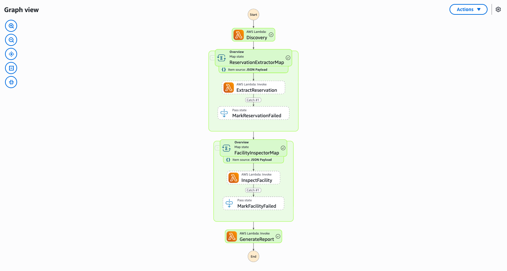

# Reise & Gastgewerbe — Demo-Leitfaden

🌐 **Language / 言語**: [日本語](demo-guide.md) | [English](demo-guide.en.md) | [한국어](demo-guide.ko.md) | [简体中文](demo-guide.zh-CN.md) | [繁體中文](demo-guide.zh-TW.md) | [Français](demo-guide.fr.md) | Deutsch | [Español](demo-guide.es.md)

## Zusammenfassung

Diese Demo zeigt eine automatisierte Pipeline zur Verarbeitung von Reservierungsdokumenten und Analyse von Gebäudeinspektionsbildern. Textract/Comprehend für die Reservierungsdatenextraktion, Rekognition/Bedrock für die Einrichtungszustandsanalyse.

**Dauer**: 3–5 Minuten

---

## Schritt-für-Schritt Bereitstellung

### Step 1: Voraussetzungen

```bash
aws --version && sam --version && python3 --version
aws sts get-caller-identity
```

### Step 2: Bereitstellung

```bash
git clone https://github.com/Yoshiki0705/fsxn-s3ap-serverless-patterns.git
cd fsxn-s3ap-serverless-patterns/travel-document-processing
sam build && sam deploy \
  --stack-name fsxn-travel-demo \
  --parameter-overrides \
    S3AccessPointAlias=<your-s3ap-alias> \
    S3AccessPointName=<your-s3ap-name> \
    VpcId=<your-vpc-id> \
    PrivateSubnetIds=<subnet-1>,<subnet-2> \
    NotificationEmail=<your-email@example.com> \
  --capabilities CAPABILITY_IAM CAPABILITY_AUTO_EXPAND \
  --region ap-northeast-1
```

### Step 3: Workflow-Ausführung

```bash
STATE_MACHINE_ARN=$(aws cloudformation describe-stacks \
  --stack-name fsxn-travel-demo \
  --query "Stacks[0].Outputs[?OutputKey=='WorkflowStateMachineArn'].OutputValue" \
  --output text --region ap-northeast-1)

aws stepfunctions start-execution --state-machine-arn $STATE_MACHINE_ARN --region ap-northeast-1
```

---

---

## Screenshots




## Bereinigung

```bash
aws cloudformation delete-stack --stack-name fsxn-travel-demo --region ap-northeast-1
```
